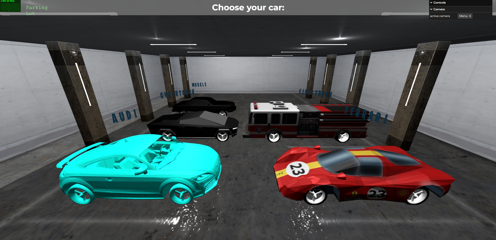
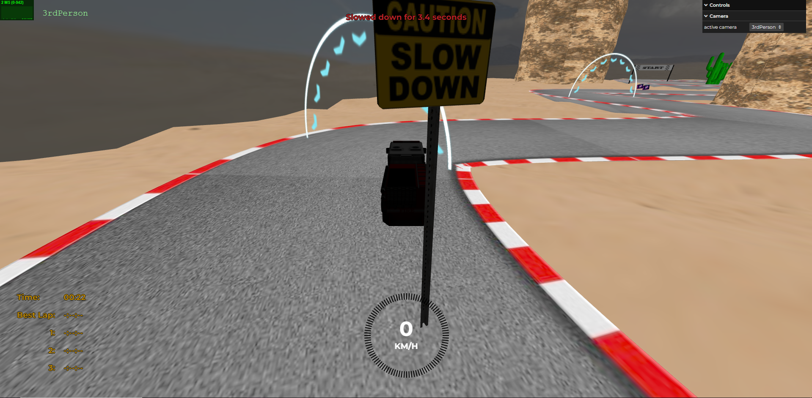

# SGI 2023/2024

## Group T03G04

| Name               | Number    | E-Mail             |
| ------------------ | --------- | ------------------ |
| João Pinheiro      | 202008133 | <up202008133@up.pt>  |
| Ricardo Cavalheiro | 202005103 | <up202005103@up.pt>  |

----

## Projects

### [TP1 - ThreeJS Basics](tp1)

- Strong points
  - Versatile, every and any object can be added or removed from the scene
  - Possibility to change the room's size and every object will adapt to it
  - Shadow projection from the outside window
  - 9 cameras from you can choose to take a look at the scene
- Scene
  
  As we step into the **room**, with a **window** to the outside. It seems it is someone's birthday as there is a **cake** with a **candle** on the **table** right in the hearth of the **room**. The 2 **lamps** fill the room with a comforting ambiance. There are **framed photographs**, on the **walls**, of the individuals that live there, maybe it's the birthday of one of them. A red **carpet** is presented on the floor  and close by there are 2 **projectors** that focus on the pictures of the guys. As it's very sunny outside the **curtains** are partially closed.
  They seem to like cars as there is a **beetle car painting** and right next to it we can see the **glass** placed on the corner of the room.
  Upon closer inspection on the table, alongside the **cake**, there's a **jar** that holds 2 **flowers**. Next to the jar, you can spot the day's folded newspaper, just like a spiral spring.

  

-----

### [TP2 - YAML scene](tp2)

- Strong points
  - Versatile as we can toggle the wireframes for every object as well as enable/disable the lights
  - Cameras from you can choose to take a look at the scene and its objects
  - Possibility to change the Fog values and to disable it
  - Light helpers to help visualize the light's position and direction
  - Appealing scene design
  - Variety of primitives and complex objects

    As we arrive at the **house** in our **car**, we can see **a big mansion** and some **trees** around it. When crossing the **gate** we can see a well maintained space. The **grass** is cut and the **car** is parked in the **garage**. Looks like there is a **person** in the **garden** drinking a **Fanta**, coming up close looks like a can of **Coke**.
    Just by the entrance door we have an outside space with some **chairs** and a **sunshade**. Entering the **house** the **door opens automatically**.
    Already inside we can see a **staircase** that leads to the second floor, some today's **newspapers** on the diner table with a nice **chandelier** above it.
    Into the cosy second floor we can see a **bed** with a **rounded pillow** .There is **lamp** on the
    **bedside table** and a **video** is playing on the tv. We can also see a **painting** that may confuse you if you look closely. Outside, in the **balcony**, there is a nice **pool filled with water** to have an enjoyable time. Leaving the house we can smell the **smoke** coming from the **chimney** and the farther we are the smoke starts to **dissipate**. The **sun** is shining bright as it is a beautiful day.

  
  

----

### [TP3 - Car game](tp3)

- Strong points
- Realistic scene
- Many cars from where you can choose from
- Easy playability (WASD to move, mouse to look around)
- Restart game is available
- Powerups and obstacles are included

As we start the game, we are asked to input our username. After that, we can choose from a variety of cars. The game will start at the starting line and for a complete of 3 laps you will race a autonomous car. You can collect powerups that will give you a speed boost. The obstacles are street signs that will slow you down. At the end, will be shown the podium scene and a lot of fireworks.

