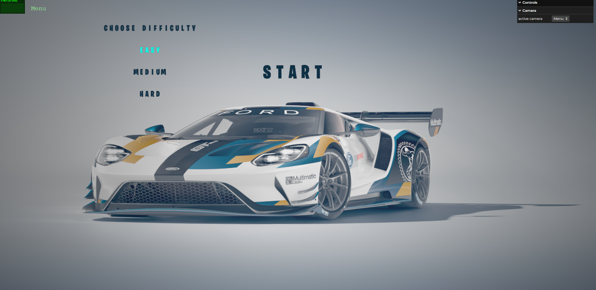
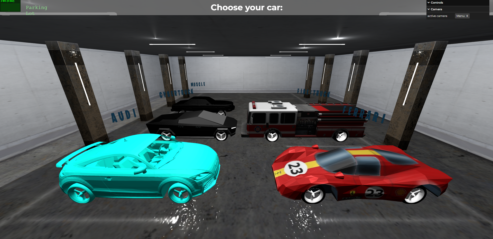
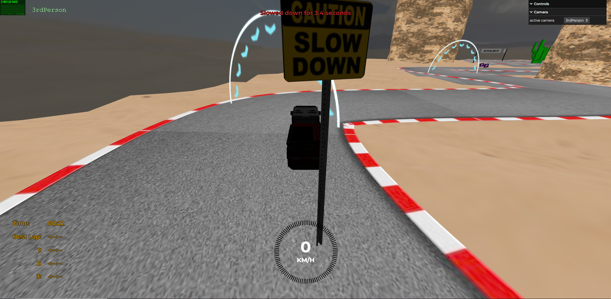
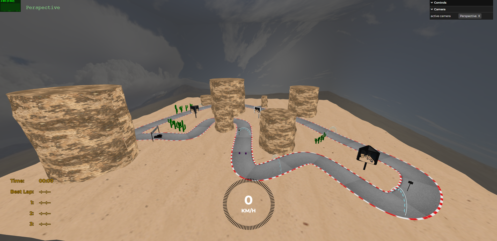
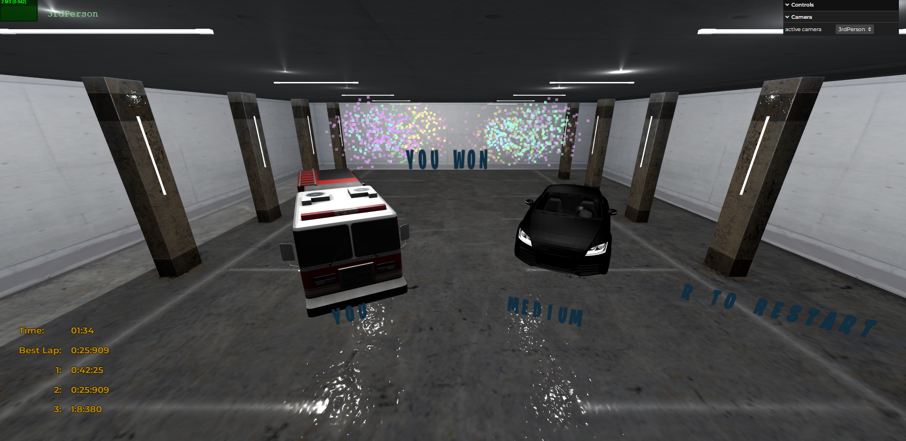

# SGI 2023/2024

## Group T03G04

| Name               | Number    | E-Mail             |
| ------------------ | --------- | ------------------ |
| João Pinheiro      | 202008133 | <up202008133@up.pt>  |
| Ricardo Cavalheiro | 202005103 | <up202005103@up.pt>  |

----

## Project Information

- Strong points
- Realistic scene
- Many cars from where you can choose from
- Easy playability (WASD to move, mouse to look around)
- Restart game is available
- Powerups and obstacles are included

As we start the game, we are asked to input our username. After that, we can choose from a variety of cars. The game will start at the starting line and for a complete of 3 laps you will race a autonomous car. You can collect powerups that will give you a speed boost. The obstacles are street signs that will slow you down. At the end, will be shown the podium scene and a lot of fireworks.

----

## Issues/Problems

- Colisões podiam ser melhoradas
- Lógica de picking bastante complexa